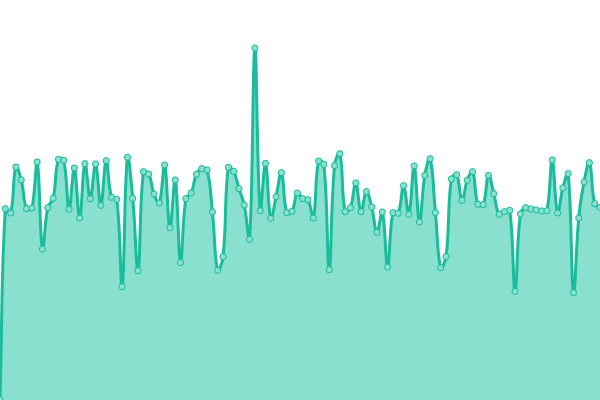
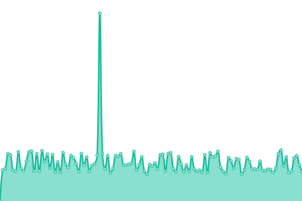
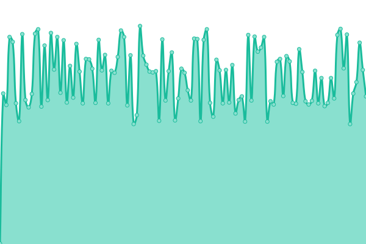
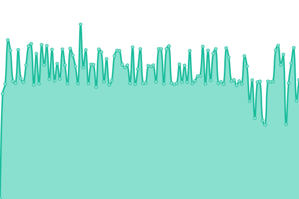

# [📈 Live Status](https://SRESchool.github.io/All-Cotocus-Websites-Uptime-Monitor): <!--live status--> **🟩 All systems operational**

This repository contains the open-source uptime monitor and status page for [SRESchool](https://SRESchool.github.io/All-Cotocus-Websites-Uptime-Monitor), powered by [Upptime](https://github.com/upptime/upptime).

With [Upptime](https://upptime.js.org), you can get your own unlimited and free uptime monitor and status page, powered entirely by a GitHub repository. We use [Issues](https://github.com/SRESchool/All-Cotocus-Websites-Uptime-Monitor/issues) as incident reports, [Actions](https://github.com/SRESchool/All-Cotocus-Websites-Uptime-Monitor/actions) as uptime monitors, and [Pages](https://SRESchool.github.io/All-Cotocus-Websites-Uptime-Monitor) for the status page.

<!--start: status pages-->
<!-- This summary is generated by Upptime (https://github.com/upptime/upptime) -->
<!-- Do not edit this manually, your changes will be overwritten -->
<!-- prettier-ignore -->
| URL | Status | History | Response Time | Uptime |
| --- | ------ | ------- | ------------- | ------ |
|  [Cotocus CN](https://cotocus.cn) | 🟩 Up | [cotocus-cn.yml](https://github.com/SRESchool/All-Cotocus-Websites-Uptime-Monitor/commits/HEAD/history/cotocus-cn.yml) | 

 625ms
     
 | 

<a href="https://SRESchool.github.io/All-Cotocus-Websites-Uptime-Monitor/history/cotocus-cn">91.06%</a>
    

|  [Cotocus COM](https://cotocus.com) | 🟩 Up | [cotocus-com.yml](https://github.com/SRESchool/All-Cotocus-Websites-Uptime-Monitor/commits/HEAD/history/cotocus-com.yml) | 

 1132ms
     
 | 

<a href="https://SRESchool.github.io/All-Cotocus-Websites-Uptime-Monitor/history/cotocus-com">85.66%</a>
    

|  [Cotocus IN](https://cotocus.in) | 🟩 Up | [cotocus-in.yml](https://github.com/SRESchool/All-Cotocus-Websites-Uptime-Monitor/commits/HEAD/history/cotocus-in.yml) | 

 444ms
     
 | 

<a href="https://SRESchool.github.io/All-Cotocus-Websites-Uptime-Monitor/history/cotocus-in">79.88%</a>
    

|  [Cotocus ORG](https://cotocus.org) | 🟩 Up | [cotocus-org.yml](https://github.com/SRESchool/All-Cotocus-Websites-Uptime-Monitor/commits/HEAD/history/cotocus-org.yml) | 

 560ms
     
 | 

<a href="https://SRESchool.github.io/All-Cotocus-Websites-Uptime-Monitor/history/cotocus-org">79.88%</a>
    

<!--end: status pages-->

[**Visit our status website →**](https://SRESchool.github.io/All-Cotocus-Websites-Uptime-Monitor)

## 📄 License

- Powered by: [Upptime](https://github.com/upptime/upptime)
- Code: [MIT](./LICENSE) © [Anand Chowdhary](https://anandchowdhary.com), supported by [Pabio](https://pabio.com)
- Data in the `./history` directory: [Open Database License](https://opendatacommons.org/licenses/odbl/1-0/)
